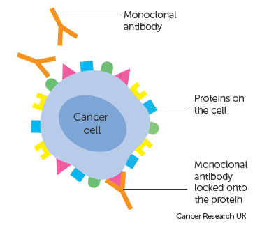

# Biosimilar

1. [Biosimilar](#biosimilar)
   1. [Monoclonal Antibodies and their Structure](#monoclonal-antibodies-and-their-structure)
   2. [Questions](#questions)
      1. [Are biosimilars the same as generic drugs?](#are-biosimilars-the-same-as-generic-drugs)
         1. [Here are ways biosimilar and generic drugs are alike:](#here-are-ways-biosimilar-and-generic-drugs-are-alike)
         2. [Here are ways biosimilar and generic drugs are different:](#here-are-ways-biosimilar-and-generic-drugs-are-different)
      2. [A biosimilar has a biologic (natural) source](#a-biosimilar-has-a-biologic-natural-source)
      3. [A biosimilar needs extra FDA approval to be used interchangeably](#a-biosimilar-needs-extra-fda-approval-to-be-used-interchangeably)
      4. [Why are biosimilars being developed?](#why-are-biosimilars-being-developed)
      5. [How are biosimilars being used in cancer treatment?](#how-are-biosimilars-being-used-in-cancer-treatment)
   3. [Biosimilars of Interest](#biosimilars-of-interest)
      1. [Why do we have biosimilars?](#why-do-we-have-biosimilars)
      2. [Ranibizumab](#ranibizumab)
         1. [Introduction](#introduction)
         2. [Why is this medication prescribed?](#why-is-this-medication-prescribed)
         3. [How should this medicine be used?](#how-should-this-medicine-be-used)
      3. [Trastuzumab](#trastuzumab)
         1. [What is trastuzumab?](#what-is-trastuzumab)
         2. [How does trastuzumab work?](#how-does-trastuzumab-work)
         3. [How do you have trastuzumab?](#how-do-you-have-trastuzumab)
            1. [Into your bloodstream](#into-your-bloodstream)
            2. [As an injection under the skin](#as-an-injection-under-the-skin)

## Monoclonal Antibodies and their Structure

A monoclonal antibody (mAb, more rarely called moAb) is an antibody produced from a cell line made by cloning a unique white blood cell. All subsequent antibodies derived this way trace back to a unique parent cell.

Monoclonal antibodies can have monovalent affinity, binding only to the same epitope (the part of an antigen that is recognized by the antibody). In contrast, polyclonal antibodies bind to multiple epitopes and are usually made by several different antibody-secreting plasma cell lineages. Bispecific monoclonal antibodies can also be engineered, by increasing the therapeutic targets of one monoclonal antibody to two epitopes.

## Questions

A biosimilar, or biosimilar drug, is a medicine that is very close in structure and function to a biologic medicine.

A biologic, or biologic drug, is a medicine made in a living system, such as yeast, bacteria, or animal cells.

Biologics used in the treatment of cancer can work in many ways. For example, they might:

- Help the body’s immune system recognize and kill cancer cells more effectively
- Work against certain proteins in or on cancer cells to stop their growth
- Help the body make more blood cells to replace the ones lost because of other cancer treatments

For some brand name biologics, one or more biosimilars are available. A biosimilar has a structure that is highly similar to, but not exactly the same, as a brand name biologic. A biosimilar behaves in much the same way, so that there are "no meaningful differences" between it and its brand name biologic. This means that the biosimilar is also considered as safe and effective as the biologic. Both come from living systems.

### Are biosimilars the same as generic drugs?

You've probably heard about generic drugs. A generic drug is an exact copy of a brand name drug. Generic drugs work the same way and can be used in the same ways as their brand name drugs. In other words, a generic drug is an equal substitute for its brand name drug and can be used to treat the same disease.

A biosimilar is a little like a generic version of a biologic drug, but there are important differences. For example, unlike a generic drug, a biosimilar is not an exact copy of its brand name drug.

#### Here are ways biosimilar and generic drugs are alike:

- Both are tested and compared to a brand name drug in studies.
- The brand name drugs they are tested against have already been approved by the US Food and Drug Administration (FDA).
- Both go through a thorough but shortened FDA review process compared to their brand name drugs.
- Both are as safe and effective as their brand name drugs.
- Both might be less expensive treatment options than their brand name drugs.

#### Here are ways biosimilar and generic drugs are different:

- A biosimilar is made from a biologic (natural) source, while a generic drug is made from chemicals.
- A biosimilar is the same in many ways as its brand name biologic drug, while a generic is an exact chemical copy of its brand name drug.
- The FDA often needs more information from studies comparing a biosimilar to its original biologic than it needs from studies done on a generic drug. This is because a biosimilar comes from a natural source and cannot be made as an exact copy of its brand name biologic.
- Biosimilars and generic drugs go through different paths for FDA approval.
- Once approved, a biosimilar needs to have special approval to be considered interchangeable with its brand name biologic, while a generic drug can be automatically substituted for its brand name drug. (This is discussed below.)
- All of these differences are due to the way biologics (and biosimilars) are made in the lab using a natural source (a living system such as yeast, bacteria, or animal cells).

### A biosimilar has a biologic (natural) source

A generic drug is an exact copy of its brand name drug (that is, it has the exact same chemical makeup). This is possible because the active ingredients in drugs are made from chemicals that have a specific structure that can be copied.

However, a biologic comes from a biologic (natural) source that cannot be copied exactly. These medicines come from very complex, living systems whose environments can change. So, while a biosimilar is the same in the most important ways, it cannot be exactly the same in its structure. A biosimilar is highly similar to its brand name drug, but not an exact copy of it.

### A biosimilar needs extra FDA approval to be used interchangeably

When a generic drug is approved by the FDA, it's usually automatically interchangeable with its brand name drug. There is no additional information needed by the FDA to show a generic drug is a safe and effective substitute for its brand name drug. Because its active ingredient has the exact same chemical structure, a prescription written for a brand name drug can usually be filled using a generic drug instead. So, a patient who is taking a generic drug can expect the same outcome as if they were taking its brand name drug, and can go back and forth between them (if needed) without seeing a difference.

When a biosimilar gets its initial FDA approval, it's not automatically interchangeable with its brand name biologic. While biosimilars can be used to treat a disease once they get initial approval, they need another, special FDA approval to be considered interchangeable before they can be substituted automatically for a brand name biologic. If a biosimilar is not approved as interchangeable, it needs a prescription to be written specifically for the biosimilar to be used instead of its brand name biologic.

There are strict FDA rules that need to be met for a biosimilar to be approved as interchangeable. Any biosimilar that's approved for use has been shown in data from clinical trials to be as safe and effective in treating a certain disease as its brand name biologic. The company that makes the biosimilar may decide to only submit data to the FDA for this initial approval. But if the company wants their biosimilar to be considered interchangeable (and therefore able to be automatically substituted for its brand name drug), they must submit more information from clinical trials to the FDA. You can read more about this on the FDA website.

### Why are biosimilars being developed?

Biologics are often very expensive because they cost a lot to study and make. And unlike the case with drugs, where generic versions can lead to increased competition and lower prices, until fairly recently there were no alternate versions of biologics.

The high cost of biologics can sometimes make it hard for a person to get them, even if they might be the best treatment for a disease. To make biologic drugs more affordable and available to more people, Congress passed the Biologics Price Competition and Innovation Act (BPCIA). This act let the FDA create a shortened approval process for biosimilars.

Some experts have estimated that biosimilars could reduce the cost of biologics over time by many billions of dollars. But this depends on how many biosimilars are approved and become available. It also depends on what types of diseases can be treated with biosimilars and how much these medicines are used.

### How are biosimilars being used in cancer treatment?

There are many biologic medicines, such as immunotherapy drugs, now being used to treat cancer, and some have biosimilar versions available. Some biosimilars have been approved to treat certain types of cancer, and some have been approved to help manage side effects. To find out more, see the List of Biosimilars Used in Cancer Treatment.

## Biosimilars of Interest

To understand what a biosimilar is, it helps to know a bit more about how drugs are made. Drugs are broadly divided into 2 groups:

- those made from chemical ingredients
- those made using living cells
- Many drugs have specific chemical ingredients, these are non-biological drugs. An example is the painkiller, ibuprofen.

Other drugs are made using living cells such as those from bacteria, plants or animals. These are called biological drugs. Examples include hormones such as insulin, drugs for arthritis and some cancer drugs.

### Why do we have biosimilars?

All new drugs go through strict testing over many years before they have a licence for general use.

Drug companies usually patent the new drugs they develop. This means only they can manufacture and sell the drugs for a specific amount of time. In the UK a patent lasts about 20 years. After this time other drug companies can make the drug, often at a cheaper price.

Copies of a non-biological drug use the exact same chemicals. The exact copy is called a generic medicine. For example, ibuprofen was originally called Nurofen. Since this drug came off patent, there are a variety of identical generic versions available.

It’s not possible to copy biological medicines exactly. When the patent for a biological medicine expires, drug companies can make a drug that is very similar to the original, but not exactly the same. These drugs are called biosimilars. A biosimilar is a highly similar copy of an existing biological drug.

As with all new drugs, biosimilars are thoroughly tested and have a licence for use.

### Ranibizumab

#### Introduction

Ranibizumab, sold under the brand name Lucentis among others, is a monoclonal antibody fragment (Fab) created from the same parent mouse antibody as bevacizumab. It is an anti-angiogenic[8] that is approved to treat the "wet" type of age-related macular degeneration (AMD, also ARMD), diabetic retinopathy, and macular edema due to branch retinal vein occlusion or central retinal vein occlusion.

#### Why is this medication prescribed?

Ranibizumab injection products are used to treat wet age-related macular degeneration (AMD; an ongoing disease of the eye that causes loss of the ability to see straight ahead and may make it more difficult to read, drive, or perform other daily activities). Ranibizumab implant (Susvimo) is also used to treat wet age-related macular degeneration after at least two successful treatments with ranibizumab or a similar medication. Ranibizumab injection products are also used to treat myopic choroidal neovascularization (mCNV; a complication in near-sighted people where new blood vessels can grow in the back of the eye) and to treat macular edema after retinal vein occlusion (an eye disease caused by blockage of blood flow from the eye that leads to blurry vision and vision loss). Ranibizumab injection (Lucentis) is also used to treat diabetic macular edema (an eye disease caused by diabetes that can lead to vision loss) and diabetic retinopathy (damage to the eyes caused by diabetes). Ranibizumab is in a class of medications called vascular endothelial growth factor A (VEGF-A) antagonists. It works by stopping abnormal blood vessel growth and leakage in the eye(s) that may cause vision loss.

Ranibizumab injection products come as a solution (liquid) to be injected into the eye by a doctor. It is usually given in a doctor's office every month. Your doctor may give you injections on a different schedule if that is best for you.

Ranibizumab also comes as an implant to be inserted into the white part of your eye with a needle by a doctor in a medical office or clinic. The implant will need to refilled by injecting with more solution into it every 6 months by a doctor in a medical office or a clinic.

#### How should this medicine be used?

Before you receive a ranibizumab injection product or implant, your doctor will clean your eye to prevent infection and numb your eye to reduce discomfort during the injection or implant. You may feel pressure in your eye when the medication is injected. After your injection, your doctor will need to examine your eyes before you leave the office.

After having the implant inserted, you may be asked to keep your head above shoulder level for the rest of the day, which includes sleeping with 3 or more pillows under your head when you sleep. You will also be provided with an eye shield which should not be removed until told to do so by your doctor and should be worn for at least 7 nights after the implant was inserted. Do not push, rub or touch that part of the eye for 30 days after the implant insertion (underneath the eyelid in the upper and outer part of the eye) or 7 days after the implant is refilled.

Ranibizumab controls certain eye conditions, but does not cure them. Your doctor will watch you carefully to see how well ranibizumab works for you. Talk to your doctor about how long you should continue treatment with ranibizumab.

### Trastuzumab

Trastuzumab is a targeted cancer drug and is also known by other names such as Herceptin, Herzuma and Ontruzant. It is a treatment for early and advanced breast cancer, advanced stomach cancer and cancer of where the food pipe joins your stomach (gastro oesophageal junction).

#### What is trastuzumab?

Trastuzumab is a targeted cancer drug. It is a treatment for cancers that have large amounts of a protein called human epidermal growth factor receptor 2 (HER2) Open a glossary item, such as:

early breast cancer (the cancer hasn't spread beyond the breast or the lymph nodes in the armpit on the same side of the body. So, the cancer hasn't spread to any other part of the body)
breast, stomach and gastro oesophageal junction cancer that has spread to another part of the body (advanced or metastatic cancer)
You might have the original drug called Herceptin, or a biosimilar such as Herzuma or Ontruzant. A biosimilar is a very similar copy of the original drug, but it is not exactly the same. Biosimilars undergo strict testing to check they work just as well as the original drug.

#### How does trastuzumab work?

Some breast and stomach cancers have large amounts of human epidermal growth factor receptor 2 (HER2). They are called HER2 positive cancers. HER2 makes the cancer cells grow and divide.

Trastuzumab is a type of targeted cancer drug called a monoclonal antibody. It works by attaching to HER2 so it stops the cancer cells from growing and dividing.

#### How do you have trastuzumab?

For breast cancer, you might have trastuzumab as a drip into your bloodstream (intravenously) or as an injection under the skin (subcutaneous). If you have trastuzumab intravenously, you may be able to switch to the subcutaneous injection.

For stomach cancer, or gastro oesophageal junction cancer, you usually have trastuzumab as a drip into your bloodstream.

##### Into your bloodstream

Each treatment takes between 30 and 90 minutes. You have the first treatment over 90 minutes and your team will check you for any side effects. Depending on the effects you have, the next infusion might be shorter.

You might have treatment through a long plastic tube that goes into a large vein in your chest. The tube stays in place throughout the course of treatment. This can be a:

- central line
- PICC line
- portacath
- If you don't have a central line, you might have treatment through a thin short tube (a cannula) that goes into a vein in your arm each time you have treatment.

##### As an injection under the skin

You might have trastuzumab as an injection under the skin, on the upper, outer part of your leg. The injection takes about 2 to 5 minutes.
