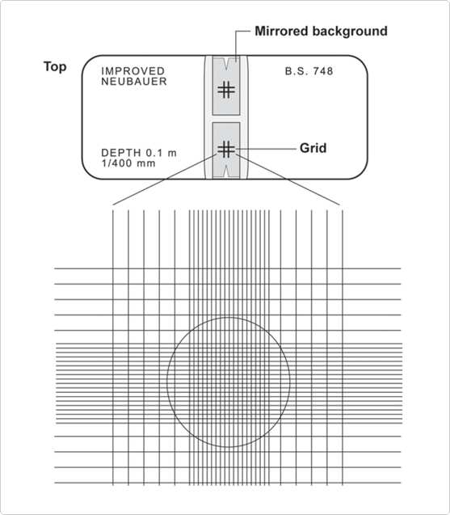

# Cell Culture Methods

1. [Cell Culture Methods](#cell-culture-methods)
   1. [Guidelines to Maintain Cultured Cells - What is subculture?](#guidelines-to-maintain-cultured-cells---what-is-subculture)
      1. [When to subculture?](#when-to-subculture)
      2. [Subculture schedule](#subculture-schedule)
      3. [Media recommendations for common cell lines](#media-recommendations-for-common-cell-lines)
   2. [Subculturing Adherent Cells](#subculturing-adherent-cells)
      1. [Materials](#materials)
      2. [Protocol for Passaging Adherent Cells](#protocol-for-passaging-adherent-cells)
   3. [Passaging Suspension Cultures](#passaging-suspension-cultures)
      1. [Suspension Culture Vessels](#suspension-culture-vessels)
      2. [Materials](#materials-1)
   4. [Freezing Cells](#freezing-cells)
      1. [Freezing medium](#freezing-medium)
      2. [Materials](#materials-2)
      3. [Protocol for cryopreserving culture cells](#protocol-for-cryopreserving-culture-cells)
      4. [Guidelines for cryopreservation](#guidelines-for-cryopreservation)
   5. [Thawing Frozen Cells](#thawing-frozen-cells)
      1. [Guidelines for thawing cells](#guidelines-for-thawing-cells)
      2. [Materials](#materials-3)
      3. [Protocol for thawing frozen cells](#protocol-for-thawing-frozen-cells)
   6. [Counting Cells in a Hemocytometer](#counting-cells-in-a-hemocytometer)
      1. [Protocol](#protocol)
   7. [Trypan Blue Exclusion](#trypan-blue-exclusion)
      1. [Protocol](#protocol-1)
   8. [Use of Antibiotics and Antimycotics](#use-of-antibiotics-and-antimycotics)
      1. [Decontaminating cultures with antibiotics and antimycotics](#decontaminating-cultures-with-antibiotics-and-antimycotics)

## Guidelines to Maintain Cultured Cells - What is subculture?

**Characteristic growth pattern of culture cells**

The growth of cells in culture follows a standard pattern. A lag after seeding is followed by a period of exponential growth, called the log phase. When the cells in adherent cultures occupy all the available substrate and have no room left for expansion, or when the cells in suspension cultures exceed the capacity of the medium to support further growth, cell proliferation is greatly reduced or ceases entirely (see Figure 4.1 below). Cells should be passaged, or subcultured, when they cover the plate, or the cell density exceeds the capacity of the medium. This will keep cells at an optimal density for continued growth and will stimulate further proliferation. Maintaining log phase growth will maximize the number of healthy cells for your experiment.

### When to subculture?

Cells in culture usually proliferate following a standard growth pattern. The first phase of growth after the culture is seeded is the lag phase, which is a period of slow growth when the cells are adapting to the culture environment and preparing for fast growth. The lag phase is followed by the log phase (i.e., “logarithmic” phase), a period where the cells proliferate exponentially and consume the nutrients in the growth medium. When all the growth medium is spent (i.e., one or more of the nutrients is depleted) or when the cells occupy all of the available substrate, the cells enter the stationary phase (i.e., plateau phase), where the proliferation is greatly reduced or ceases entirely.

In Mammalian cells, Adherent cultures should be passaged when they are in the log phase, before they reach confluence. Normal cells stop growing when they reach confluence (contact inhibition), and it takes them longer to recover when reseeded. Transformed cells can continue proliferating even after they reach confluence, but they usually deteriorate after about two doublings. Similarly, cells in suspension should be passaged when they are in log-phase growth before they reach confluency. When they reach confluency, cells in suspension clump together and the medium appears turbid when the culture flask is swirled.

A drop in the pH of the growth medium usually indicates a buildup of lactic acid, which is a by-product of cellular metabolism. Lactic acid can be toxic to the cells, and the decreased pH can be sub-optimal for cell growth. The rate of change of pH is generally dependent on the cell concentration in that cultures at a high cell concentration exhaust medium faster than cells lower concentrations. You should subculture your cells if you observe a rapid drop in pH (>0.1 – 0.2 pH units) with an increase in cell concentration.

### Subculture schedule

When conducting cell passaging, adhering to a strict schedule ensures reproducible behavior and allows you to monitor their health status. Vary the seeding density of your cultures until you achieve consistent growth rate and yield appropriate for your cell type from a given seeding density. Deviations from the growth patterns thus established usually indicate that the culture is unhealthy (e.g., deterioration, contamination) or a component of your culture system is not functioning properly (e.g., temperature is not optimal, culture medium too old). We strongly recommend that you keep a detailed cell culture log, listing the feeding and subculture schedules, types of media used, the dissociation procedure followed, split ratios, morphological observations, seeding concentrations, yields, and any anti-biotic use.

It is best to perform experiments and other non-routine procedures (e.g., changing type of media) according to your subculture schedule. If your experimental schedule does not fit the routine subculture schedule, make sure that you do not passage your cells while they are still in the lag period or when they have reached confluency and ceased growing.

### Media recommendations for common cell lines

Many continuous mammalian cell lines can be maintained on a relatively simple medium such as MEM supplemented with serum, and a culture grown in MEM can probably be just as easily grown in DMEM or Medium 199. However, when a specialized function is expressed, a more complex medium may be required. Information for selecting the appropriate medium for a given cell type is usually available in published literature and may also be obtained from the source of the cells or cell banks.

If there is no information available on the appropriate medium for your cell type, choose the growth medium and serum empirically or test several different media for best results. In general, a good place to start is MEM for adherent cells and RPMI-1640 for suspension cells.

Insect cells are cultured in growth media that are usually more acidic than those used for mammalian cells such as TNM-FH and Grace’s medium.

## Subculturing Adherent Cells

### Materials

- Culture vessels containing your adherent cells
- Tissue-culture treated flasks, plates or dishes
- Complete growth medium, pre-warmed to 37°C
- Disposable, sterile 15-mL tubes
- 37°C incubator with humidified atmosphere of 5% CO2
- Balanced salt solution such as Dulbecco’s Phosphate Buffered Saline (DPBS), containing no calcium, magnesium, or phenol red
- Dissociation reagent such as trypsin or Gibco TrypLE Express, without phenol red
- Reagents and equipment to determine viable and total cell counts such as Automated Cell Counter, Trypan Blue and hemocytometer.

### Protocol for Passaging Adherent Cells

All solutions and equipment that come in contact with the cells must be sterile. Always use proper sterile technique and work in a laminar flow hood.

- Remove and discard the spent cell culture media from the culture vessel.
- Wash cells using a balanced salt solution without calcium and magnesium (approximately 2 mL per 10 cm2 culture surface area). Gently add wash solution to the side of the vessel opposite the attached cell layer to avoid disturbing the cell layer, and rock the vessel back and forth several times.
- Remove and discard the wash solution from the culture vessel
- Add the pre-warmed dissociation reagent such as trypsin or TrypLE to the side of the flask; use enough reagent to cover the cell layer (approximately 0.5 mL per 10 cm2). Gently rock the container to get complete coverage of the cell layer.
- Incubate the culture vessel at room temperature for approximately 2 minutes. Note that the actual incubation time varies with the cell line used.
- Observe the cells under the microscope for detachment. If cells are less than 90% detached, increase the incubation time a few more minutes, checking for dissociation every 30 seconds. You may also tap the vessel to expedite cell detachment.
- When ≥ 90% of the cells have detached, tilt the vessel for a minimal length of time to allow the cells to drain. Add the equivalent of 2 volumes (twice the volume used for the dissociation reagent) of pre-warmed complete growth medium. Disperse the medium by pipetting over the cell layer surface several times.
- Transfer the cells to a 15-mL conical tube and centrifuge them at 200 × g for 5 to 10 minutes. Note that the centrifuge speed and time vary based on the cell type.
- Resuspend the cell pellet in a minimal volume of pre-warmed complete growth medium and remove a sample for counting.
- Determine the total number of cells and percent viability using a hemocytometer, cell counter and Trypan Blue exclusion, or the Invitrogen Countess Automated Cell Counter. If necessary, add growth media to the cells to achieve the desired cell concentration and recount the cells.
- Dilute cell suspension to the seeding density recommended for the cell line, and pipet the appropriate volume into new cell culture vessels, and return the cells to the incubator.

## Passaging Suspension Cultures

Sub-culturing suspension cells is somewhat less complicated than passaging adherent cells. Because the cells are already suspended in growth medium, there is no need to treat them enzymatically to detach them from the surface of the culture vessel, and the whole process is faster and less traumatic for the cells. Replacement of growth medium is not carried out in suspension cultures; instead, the cells are maintained by feeding them every 2 to 3 days until they reach confluency. This can be done by directly diluting the cells in the culture flask and continue expanding them, or by withdrawing a portion of the cells from the culture flask and diluting the remaining cells down to a seeding density appropriate for the cell line. Usually, the lag period following the passaging is shorter than that observed with adherent cultures.

### Suspension Culture Vessels

Suspension cultures can be maintained in sterile culture flasks (e.g., shaker flasks without baffles) that are not tissue-culture treated; however, spinner flasks (i.e., stirrer bottles) specifically designed for suspension cell culture allow for superior gas exchange and permit higher volumes of cells to be cultured.

Spinner flasks have two basic designs; the medium is agitated (i.e., stirred) by a hanging stir-bar assembly or with a vertical impeller. The vertical impeller provides better aeration. The total culture volume in a spinner flask should not exceed half of the indicated volume of the spinner for proper aeration (e.g., a 500 mL spinner should never contain more than 250 mL of culture).

### Materials

- Culture vessels containing your suspension cells
- Shaker flasks without baffles or spinner bottles (see Suspension Culture Vessels)
- Complete growth medium, pre-warmed to 37°C
- 37°C incubator with humidified atmosphere of 5% CO2
- Magnetic stir plate (if using spinner flasks), roller rack (if using roller bottles), or shaking platform (if using conventional culture flasks or petri dishes)
- Reagents and equipment to determine viable and total cell counts (e.g., Automated Cell Counter, Trypan Blue and hemacytometer)

All solutions and equipment that come in contact with the cells must be sterile.

Always use proper sterile technique and work in a laminar flow hood. Subculture cells when they are in log-phase growth before they reach confluency. When they reach confluency, cells in suspension clump together and the medium appears turbid when the culture flask is swirled. The maximum recommended cell density before passaging varies with cell lines; refer to the cell-specific product insert or manual for details.

- When the cells are ready for passaging (i.e., log-phase growth before they reach confluency), remove the flask from the incubator and take a small sample from the culture flask using a sterile pipette. If cells have settled down before taking the sample, swirl the flask to evenly distribute the cells in the medium.
- From the sample, determine the total number of cells and percent viability using the Countess Automated Cell Counter or a hemacytometer, cell counter, and Trypan Blue exclusion.
- Calculate the volume of media that you need to add to dilute the culture down to the recommended seeding density.
- Aseptically add the appropriate volume of pre-warmed growth medium into the culture flask. You may split the culture to multiple flasks if needed.
- Loosen the caps of the culture flasks one full turn to allow for proper gas exchange (or use a gas-permeable cap), and return the flasks to the shaking incubator. The shaking speed depends on the cell line.

## Freezing Cells

Cell lines in continuous culture are likely to suffer undesirable outcomes such as genetic drift, senescence, and microbial contamination, and even the best-run laboratories can experience equipment failure. An established cell line is a valuable resource, and its replacement is expensive and time consuming. Therefore, it is vitally important that they are frozen down and preserved for long-term storage. A properly maintained frozen cell stock is an important part of cell culture.

As soon as a small surplus of cells becomes available from subculturing, the best preservative method is to keep them frozen as a seed stock, protected, and not be made available for general laboratory use. Working stocks can be prepared and replenished from frozen seed stocks. If the seed stocks become depleted, cryopreserved working stocks can then serve as a source for preparing a fresh seed stock with a minimum increase in generation number from the initial freezing.

The general freezing method is the same for adherent and suspension cells, except that adherent cells need to be removed from the culture plates before starting the freezing procedure. The best method for cryopreserving cultured cells is storing them in liquid nitrogen in complete medium in the presence of a cryoprotective agent such as dimethyl sulfoxide (DMSO). Cryoprotective agents reduce the freezing point of the medium and allow a slower cooling rate, greatly reducing the risk of ice crystal formation, which can damage cells and cause cell death.

### Freezing medium

Always use the recommended freezing medium for cryopreserving your cells. The freezing medium should contain a cryoprotective agent such as DMSO or glycerol. You may also use a specially formulated complete cryopreservation medium such as Gibco Recovery Cell Culture Freezing Medium or Gibco Synth-a-Freeze Cryopreservation Medium.

Recovery Cell Culture Freezing Medium is a ready-to-use complete cryopreservation medium for mammalian cell cultures, containing an optimized ratio of fetal bovine serum to bovine serum for improved cell viability and cell recovery after thawing.
Synth-a-Freeze Cryopreservation Medium is a chemically defined, protein-free, sterile cryopreservation medium containing 10% DMSO that is suitable for the cryopreservation of many stem and primary cell types with the exception of melanocytes.

### Materials

- Culture vessels containing cultured cells in log-phase of growth
- Complete growth medium
- Cryoprotective agent such as DMSO (use a bottle set aside for cell culture; open only in a laminar flow hood) or a freezing medium such as Synth-a-Freeze Cryopreservation Medium or Recovery Cell Culture Freezing Medium
- Disposable, sterile 15-mL or 50-mL conical tubes
- Reagents and equipment to determine viable and total cell counts (e.g.,Invitrogen Countess II FL Automated Cell Counter, or hemocytometer, cell counter, and Trypan Blue)
- Sterile cryogenic storage vials (i.e., cryovials)
- Controlled rate freezing apparatus or isopropanol chamber
- Liquid nitrogen storage container

### Protocol for cryopreserving culture cells

- Prepare freezing medium and store at 2° to 8°C until use. Note that the appropriate freezing medium depends on the cell line.
- For adherent cells, gently detach cells from the tissue culture vessel following the procedure used during the subculture. Resuspend the cells in complete medium required for that cell type.
- Determine the total number of cells and percent viability using a hemocytometer, cell counter, and Trypan Blue exclusion, or the Countess Automated Cell Counter. According to the desired viable cell density, calculate the required volume of freezing medium.
- Centrifuge the cell suspension at approximately 100–200 × g for 5 to 10 minutes. Aseptically decant supernatant without disturbing the cell pellet.
- Resuspend the cell pellet in cold freezing medium at the recommended viable cell density for the specific cell type.
- Dispense aliquots of the cell suspension into cryogenic storage vials. As you aliquot them, frequently and gently mix the cells to maintain a homogeneous cell suspension.
- Freeze the cells in a controlled rate freezing apparatus, decreasing the temperature approximately 1°C per minute. Alternatively, place the cryovials containing the cells in an isopropanol chamber and store them at –80°C overnight.
- Transfer frozen cells to liquid nitrogen, and store them in the gas phase above the liquid nitrogen.

### Guidelines for cryopreservation

Following the guidelines below is essential for cryopreserving your cell lines for future use. As with other cell culture procedures, we recommend that you closely follow the instructions provided with your cell line for best results.

- Freeze your cultured cell samples at a high concentration and at as low a passage number as possible. Make sure that the cells are at least 90% viable before freezing. Note that the optimal freezing conditions depend on the cell line in use.
- Freeze the cells slowly by reducing the temperature at approximately 1°C per minute using a controlled rate cryo-freezer or a cryo-freezing container.
- Always use the recommended freezing medium. The freezing medium should contain a cryoprotective agent such as DMSO or glycerol.
- Cell samples should be stored in vapor phase liquid nitrogen below –135°C.
- Always use sterile cryovials for storing frozen cells. Cryovials containing the frozen cells may be stored immersed in liquid nitrogen or in the gas phase above the liquid nitrogen.
- Always wear personal protective equipment.
- All solutions and equipment that come in contact with the cells must be sterile. Always use proper sterile technique and work in a laminar flow hood.

## Thawing Frozen Cells

### Guidelines for thawing cells

The thawing procedure is stressful to a frozen culture. Using good technique and working quickly ensures that a high proportion of the cells survive the procedure. As with other cell culture procedures, we recommend that you closely follow the instructions provided with your cells and other reagents for best results when freezing and thawing.

- Thaw frozen cells rapidly (< 1 minute) in a 37°C water bath.
- Dilute the thawed cells slowly before you incubate them, using pre-warmed growth medium.
- Plate thawed cells at high density to optimize recovery.
- Always use proper aseptic technique and work in a laminar flow hood.
- Always wear personal protective equipment, including a face mask or goggles. Cryovials stored in liquid-phase present a risk of explosion when thawed.
- Some freezing media contain DMSO, which is known to facilitate the entry of organic molecules into tissues. Handle reagents containing DMSO using equipment

### Materials

Cryovial containing frozen cells

- Complete growth medium, pre-warmed to a temperature of 37°C
- Disposable, sterile centrifuge tubes
- Water bath at a temperature of 37°C
- 70% ethanol
- Tissue-culture treated flasks, plates, or dishes

### Protocol for thawing frozen cells

- Remove the cryovial containing the frozen cells from liquid nitrogen storage and immediately place it into a 37°C water bath.
- Quickly thaw the cells (< 1 minute) by gently swirling the vial in the 37°C water bath until there is just a small bit of ice left in the vial.
- Transfer the vial it into a laminar flow hood. Before opening, wipe the outside of the vial with 70% ethanol.
- Transfer the desired amount of pre-warmed complete growth medium appropriate for your cell line dropwise into the centrifuge tube containing the thawed cells.
- Centrifuge the cell suspension at approximately 200 × g for 5–10 minutes. The actual centrifugation speed and duration varies depending on the cell type.
- After the centrifugation, check the clarity of supernatant and visibility of a complete pellet. Aseptically decant the supernatant without disturbing the cell pellet.
- Gently resuspend the cells in complete growth medium, and transfer them into the appropriate culture vessel and into the recommended culture environment.

## Counting Cells in a Hemocytometer

### Protocol

Hemocytometers may be obtained from most major laboratory suppliers (e.g., Baxter Scientific). The procedure below provides some general directions on how to use the hemocytometer.

- Clean the chamber and cover slip with alcohol. Dry and fix the coverslip in position.
- Harvest the cells. Add 10 μL of the cells to the hemocytometer. Do not overfill.
- Place the chamber in the inverted microscope under a 10X objective. Use phase-contrast to distinguish the cells.
- Count the cells in the large, central gridded square (1 mm2). The gridded square is circled in the graphic below. Multiply by 104 to estimate the number of cells per mL. Prepare duplicate samples and average the count.

## Trypan Blue Exclusion

### Protocol

The following procedure will enable you to accurately determine the cell viability. Cell viability is calculated as the number of viable cells divided by the total number of cells within the grids on the hemacytometer. If cells take up trypan blue, they are considered non-viable.

- Determine the cell density of your cell line suspension using a hemacytometer.
- Prepare a 0.4% solution of trypan blue in buffered isotonic salt solution, pH 7.2 to 7.3 (i.e., phosphate-buffered saline).
- Add 0.1 mL of trypan blue stock solution to 0.1 mL of cells.
- Load a hemacytometer and examine immediately under a microscope at low magnification.
- Count the number of blue staining cells and the number of total cells. Cell viability should be at least 95% for healthy log-phase cultures.
- % viable cells = [1.00 – (Number of blue cells ÷ Number of total cells)] × 100

To calculate the number of viable cells per mL of culture, use the formula below. Remember to correct for the dilution factor.

Number of viable cells × 104 × 1.1 = cells/mL culture

## Use of Antibiotics and Antimycotics

The decision to use antibiotics to prevent contamination should be based on the individual researcher's needs and experience. The following table is a general guide for use of Gibco antibiotics in cell culture media. The concentrations given are for cell culture media containing serum; serum-free media generally require lower concentrations. Also available are solutions that use one or more antibiotics in conjunction with an antimycotic. For all media types, optimal concentrations of antibiotics and antimycotics should be determined empirically.

### Decontaminating cultures with antibiotics and antimycotics

When an irreplaceable culture becomes contaminated, researchers may attempt to eliminate or control the contamination.

First, determine if the contamination is bacteria, fungus, mycoplasma, or yeast. Isolate the contaminated culture from other cell lines. Clean incubators and laminar flow hoods with a laboratory disinfectant, and check HEPA filters. Antibiotics and antimycotics at high concentrations can be toxic to some cell lines; therefore, perform a dose response test to determine the level at which an antibiotic or antimycotic becomes toxic. This is particularly important when using an antimycotic such as FUNGIZONE or an antibiotic such as tylosin, Cipro, or M-Plasmocin.

The following is a suggested procedure for determining toxicity levels and decontaminating cultures.

- Dissociate, count, and dilute the cells in antibiotic-free medium. Dilute the cells to the concentration used for regular cell passage.
- Dispense the cell suspension into a multiwell culture plate or several small flasks. Add the antibiotic of choice to each well in a range of concentrations. For example, for FUNGIZONE, 0.25, 0.50, 1.0, 2.0, 4.0, and 8.0 μg/ml.
- Observe the cells daily for signs of toxicity such as sloughing, appearance of vacuoles, decrease in confluency, and rounding.
- When the toxic antibiotic level has been determined, culture the cells for two to three passages using the antibiotic at a concentration one- to two-fold lower than the toxic concentration.
- Culture the cells for one passage in antibiotic-free media.
- Repeat step 4.
- Culture the cells in antibiotic-free medium for 4 to 6 passages to determine if the contamination has been eliminated.
